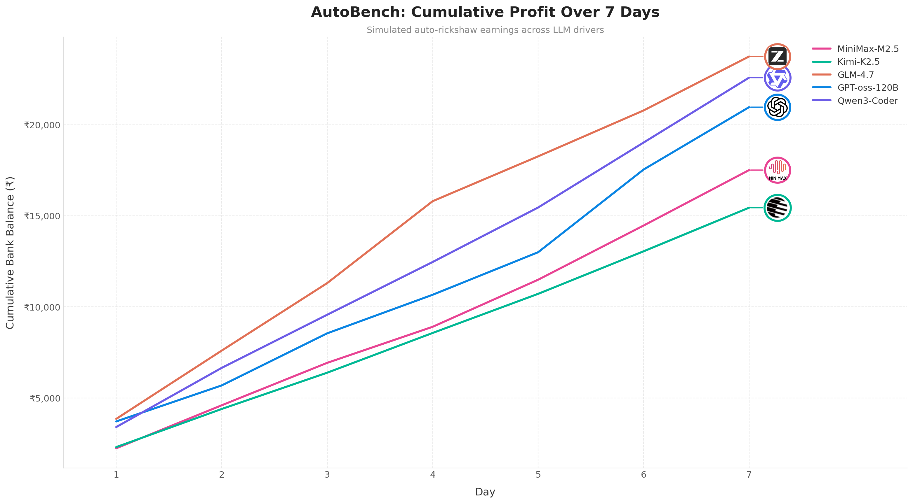

# AutoBench

AutoBench is an agentic benchmark for evaluating LLMs as Bengaluru auto-rickshaw drivers. It simulates a 7-day period where an LLM makes decisions about accepting rides, managing time, and maximizing profits.

## Features

- Simulates realistic auto-rickshaw driving economics in Bengaluru
- Implements Bengaluru-specific fare structure (day/night rates)
- Models traffic patterns based on time of day and location types
- Includes weather effects (rain increases fares but worsens traffic)
- Supports configurable shift duration (default: 12 hours)
- Tracks fuel costs, deadhead returns, and net profits
- Generates ride offers based on realistic demand patterns

## Bengaluru Traffic Simulation

- Different multipliers based on time of day (morning rush, midday, evening, night)
- Auto-rickshaw speed varies by time and location
- Petrol at Rs 100/litre, 25 km/litre efficiency, idle burn while waiting
- Many locations like IT parks, markets, residential areas, and transit hubs
- Higher demand at specific times (morning IT rush, evening residential)
- Wait times varies by hub tier - major hubs (Tier 1) have shorter waits, remote areas (Tier 3) have longer waits
- 20% chance of rain daily, increases traffic time by 1.5x and fares by 1.3x
- Dynamic pricing based on demand at different times and locations

## Usage

### Installation

```bash
uv sync
```

### Running the Benchmark

```bash
uv run main.py
```

With custom arguments:

```bash
uv run main.py --model gpt-4o-mini --days 7 --output results/
```

### Configuration

Edit `src/config.py` to customize:

- API_BASE_URL: Change the base URL for your LLM provider
- DEFAULT_MODEL: Set the default model to use
- SHIFT_DURATION_MINUTES: Adjust shift length
- Fare rates and fuel costs
- Weather probability and multipliers

### Running Multiple Models

```bash
uv run benchmark_all.py
```

### Visualizing Results

```bash
uv run visualizer.py
```

## Results



Cumulative profit over 7 days for different LLM models.

## Limitations

- Real auto drivers often bargain with passengers. This simulation uses fixed fare structure.
- Unexpected events like VIP movements, road closures, or protests cannot be predicted.
- I used OSRM (Open Source Routing Machine) for route distances, multiplied by a heuristic factor based on local knowledge. This is not as accurate as Google Maps Traffic API.
- Only 5 open-source LLMs have been tested so far due to the cost of running closed-source models.
- The benchmark runs for 7 days by default due to API cost constraints. Extending to 30 days would significantly increase expenses but would be more accurate.

## Contributions

Contributions are welcome:

- Adding more LLM models to test
- Improving traffic heuristics
- Extending the simulation period
- Fixing bugs or improving accuracy

## License

MIT
